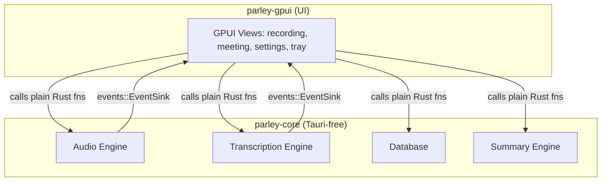

# System Architecture

Parley is a self-contained desktop application built with
[GPUI](https://www.gpui.rs/) (the UI framework behind Zed). A Tauri-free
Rust core (`parley-core`) and the GPUI shell (`parley-gpui`) link into a
single native binary — no webview, no JavaScript, no IPC layer.

## High-Level Architecture Diagram

## Component Details

### UI shell (`parley-gpui`)

*   Provides the user interface for managing meetings, displaying transcriptions, and configuring the application, plus the system tray.
*   Calls into `parley-core` as plain Rust function calls — no command/IPC boundary — and receives updates back through the `events::EventSink` trait (`emit_event(name, &payload)`), which the shell wires to GPUI's own update loop.

### Core (`parley-core`)

*   **Audio Engine:** Captures audio from the microphone and system via native PipeWire, processes it (AEC, VAD, loudness normalisation), and prepares it for transcription.
*   **Transcription Engine:** Uses local speech-to-text models (Whisper or Parakeet) to transcribe the captured audio. It can be accelerated with a GPU (CUDA/Vulkan) or run on CPU.
*   **Database:** A local SQLite database (via sqlx) that stores meeting metadata, transcripts, and summaries.
*   **Summary Engine:** Generates meeting summaries using various Large Language Models (LLMs), including a built-in llama.cpp sidecar (`llama-helper`) or remote Ollama / Claude / Groq / OpenRouter / OpenAI-compatible endpoints.

`parley-core` has no dependency on `parley-gpui` or any UI framework, so a
future UI shell could link it the same way.
